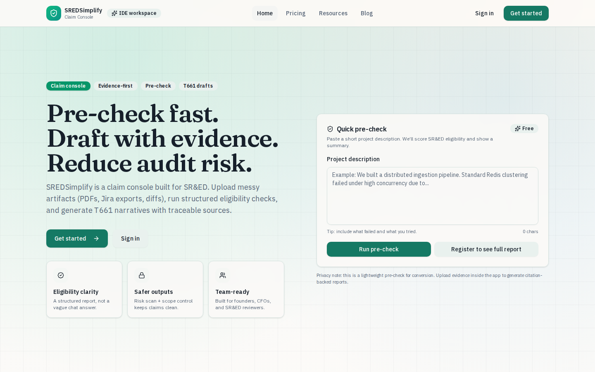
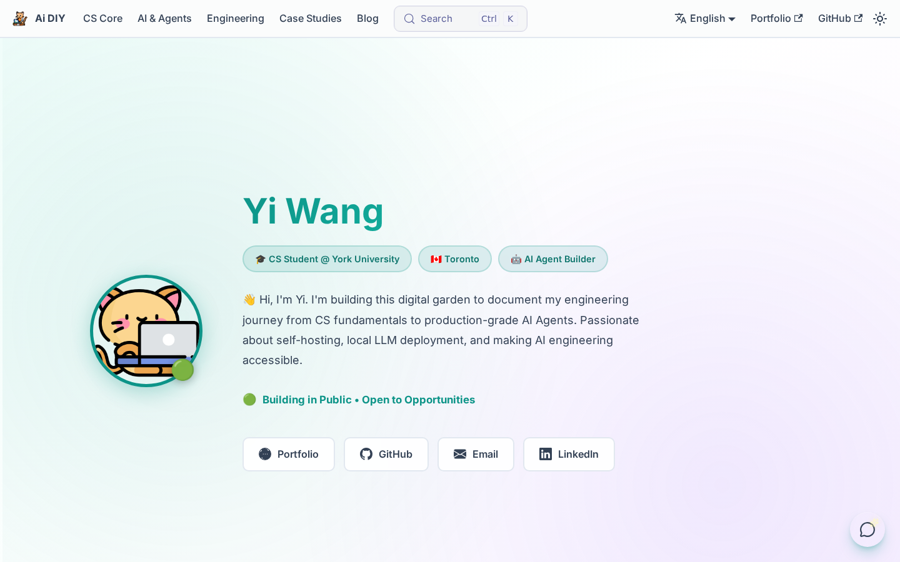
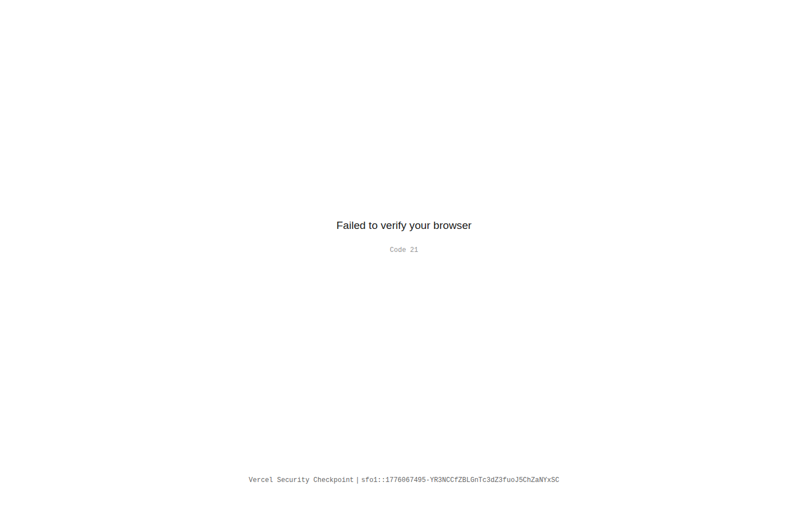
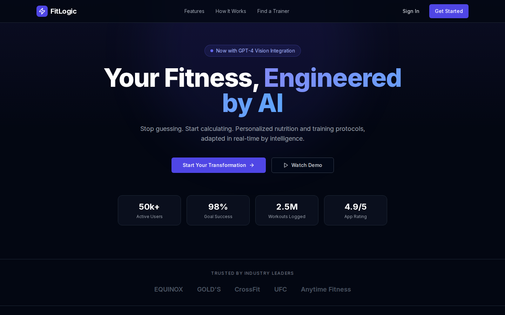
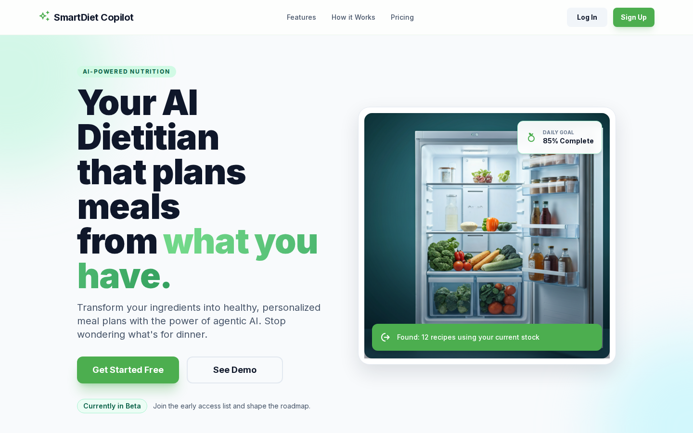
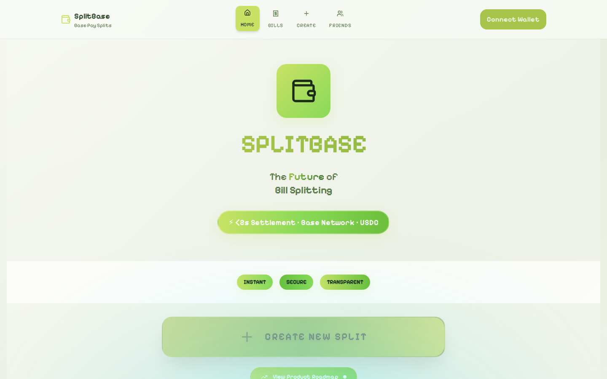

# Hi, I'm Yi Wang

**AI Systems Builder · Full-Stack Engineer · Toronto, Canada**

---

## About Me

I am a CS student at **York University** focused on designing and shipping **AI-native products** that combine agent orchestration, reliable backend services, and strong product UX.

I care most about long-term engineering directions:
- **Direction 1 — Agentic Product Systems**: building practical multi-agent workflows for real user tasks.
- **Direction 2 — Applied LLM Infrastructure**: RAG pipelines, retrieval quality, and robust inference workflows.
- **Direction 3 — AI + Full-Stack Delivery**: turning models into production-ready web applications with measurable outcomes.
- **Direction 4 — Developer Knowledge Platforms**: documenting reproducible patterns for AI engineering and software delivery.

Contributor at [OpenClaw](https://github.com/openclaw/openclaw), and actively open to collaboration on product-focused AI projects.

---

## Current Focus Map

| Focus Direction | What I'm Building | Representative Output |
| --- | --- | --- |
| Agentic enterprise workflow | Structured claim intelligence and evidence-driven review | [SREDSimplify](https://sredsimplify.com/) |
| AI engineering knowledge system | Production-style docs for CS/AI/backend/frontend/DevOps | [Ai DIY Docs](https://docs.yiw.me/) |
| Interactive digital twin | Multi-agent portfolio with real-time Q&A and retrieval | [yiw.me](https://www.yiw.me/) |
| Agentic consumer assistants | Personalized planning for fitness and nutrition contexts | [FitLogic](https://fitlogic.vercel.app/), [SmartDiet Copilot](https://dietcopilot.vercel.app/) |

---

## Featured Projects

### Core Products

<table>
  <tr>
    <td width="33%" valign="top">
      <h4>1) SREDSimplify</h4>
      
      

        <strong>SR&ED claim console</strong> with evidence ingestion, structured pre-checks, and audit-friendly T661 drafting workflow for founders and reviewers.
      

      

        
      

    </td>
    <td width="33%" valign="top">
      <h4>2) Ai DIY Docs</h4>
      
      

        <strong>Engineering knowledge base</strong> covering CS core, AI agents, backend/frontend, and DevOps content, built as a production-ready documentation platform.
      

      

        
        
      

    </td>
    <td width="33%" valign="top">
      <h4>3) AI Portfolio Digital Twin</h4>
      
      

        <strong>Multi-agent interactive portfolio</strong> with Google ADK orchestration, RAG retrieval, and streaming chat to answer resume/project questions in real time.
      

      

        
        
      

    </td>
  </tr>
</table>

### Hackathon Products

<table>
  <tr>
    <td valign="top">
      <h4>🏆 Possibility — <i>Adventure X 2026 Track 1st Prize</i></h4>
      

        <strong>AI decision companion</strong> for young professionals navigating career transitions. A 3-stage funnel: streaming AI chat surfaces emotional context &amp; decision signals → structured matching with 3 real human experiences across different outcomes with rationale → paid conversion. Built solo in 6 days (189 commits) from concept to shipped product.
      

      

        
        
      

    </td>
  </tr>
  <tr>
    <td width="33%" valign="top">
      <h4>FitLogic</h4>
      
      

        <strong>AI fitness coaching experience</strong> focused on adaptive training + nutrition logic, progress analytics, and coach-assisted personalization.
      

      

        
      

    </td>
    <td width="33%" valign="top">
      <h4>SmartDiet Copilot</h4>
      
      

        <strong>Agentic AI dietitian</strong> that combines receipt/fridge/meal perception with goal-aware planning to reduce waste and deliver actionable meal decisions.
      

      

        
        
      

    </td>
    <td width="33%" valign="top">
      <h4>SplitBase</h4>
      
      

        <strong>Base Pay bill-splitting app</strong> for group settlements with USDC, real-time status tracking, share links/QR flows, and optional NFT receipts.
      

      

        
        
      

    </td>
  </tr>
</table>

---

## Tech Stack (Aligned with Recent Projects)

### AI & Agent Systems

### Application Engineering

### Frontend & Product Delivery

### DevOps & Workflow

---

## Contribution Activity

<picture>
  <source media="(prefers-color-scheme: dark)" srcset="https://raw.githubusercontent.com/YiWang24/YiWang24/output/github-contribution-grid-snake-dark.svg">
  <source media="(prefers-color-scheme: light)" srcset="https://raw.githubusercontent.com/YiWang24/YiWang24/output/github-contribution-grid-snake.svg">
  
</picture>

---

## GitHub Stats

  
  

---

  <i>Building reliable AI products through clear engineering direction.</i>

